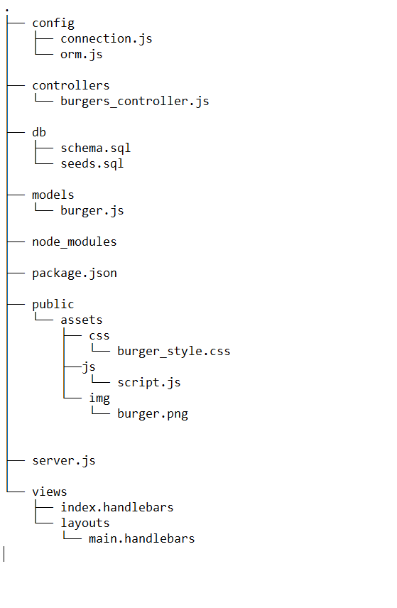
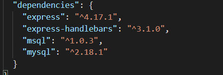

# Burger-Get-In-To-My-Tummy-

## Table of contents
* [About](##About)
* [Installation](##Installation)
* [Run](##Run)
* [Dependencies](##Dependencies)
* [Technologies](##Technologies)
* [Deployement](##Deployment)
* [Demo](##Demo)
* [License](##License)
* [Author](##Author)

## About

* This application is an example of MVC design pattern that uses MySQL, Node, Express, Handlebars and ORM (CRUD - create, post, update, delete). 

* Structure

## Installation
* npm i
* npm i express
* npm i mysql
* npm i express-handlebars

## Run
* node server.js

## Dependencies

## Technologies
* JavaScript
* Node.js
* MySQL
* Express
* Bootstrap
* NPM
* jQuery

## Deployment
The application is deployed on Heroku.
* https://enigmatic-temple-71661.herokuapp.com/

## Demo

* <a href="https://drive.google.com/file/d/1QDFTxSZKRT_CgPKiHWf9YxPdY7JvBeVK/view"> Click here for a video demo </a>

## License
see The MIT License (MIT)

## Author 
* Lloyd Marcelino, 02/29/2020